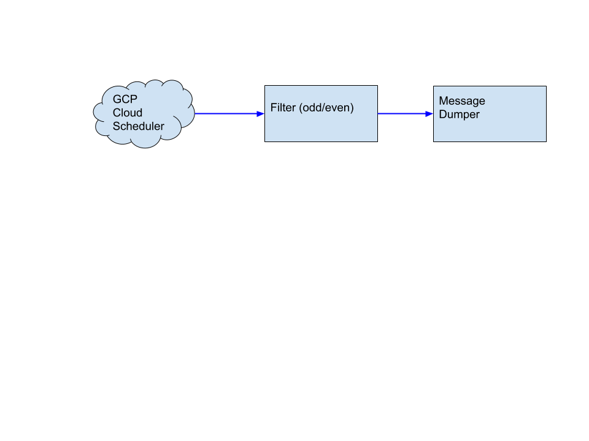

# Multtiple Functions working together

## Overview

This example builds on the simple Source to Function model, with very simple functions
demonstrating how to wire multiple functions together so that simple functions can
be wired together for more complex tasks.

## Prerequisites

1. [Prerequisites from simple case](./README.md)
1. [Create a GCP Service Account and install Cloud Scheduler Source](/README.md)

## Creating a Filter function

For the first example, we're going to create a filtering function. Filtering function
is extremely simple and is only meant to demonstrate ability to filter things for
functions downstream.




## Create a Knative Service (Filter function) that will be invoked for each Scheduler job invocation

To verify the `Cloud Scheduler` is working, we will create a simple Knative
`Service` that dumps incoming messages to its log. The `service.yaml` file
defines this basic service.

```yaml
apiVersion: serving.knative.dev/v1alpha1
kind: Service
metadata:
  name: filter
  namespace: default
spec:
  runLatest:
    configuration:
      revisionTemplate:
        spec:
          container:
            image: us.gcr.io/probable-summer-223122/filter-55ddf8a10bddee5b31712a5ad318a3a3@sha256:49f619aa72aa0ff10b9797cd8fb6365aa795c244eb0f32fdf9533d93b8e018ff
```

Enter the following command to create the service from `filter.yaml`:

```shell
kubectl --namespace default apply -f https://raw.githubusercontent.com/vaikas-google/csr/master/filter.yaml
```

## Create a Knative Service that will be invoked for each job invocation that passes the filter

```yaml
apiVersion: serving.knative.dev/v1alpha1
kind: Service
metadata:
  name: message-dumper
spec:
  runLatest:
    configuration:
      revisionTemplate:
        spec:
          container:
            image: gcr.io/knative-releases/github.com/knative/eventing-sources/cmd/message_dumper
```

Enter the following command to create the service from `service.yaml`:

```shell
kubectl --namespace default apply -f https://raw.githubusercontent.com/vaikas-google/csr/master/service.yaml
```


## Create a Channel resource for receiving events for filtering.
In order to be able to provide a Fanout for Events, or to be able to subscribe to output
of Functions (or return values), you need to wire them into channels. First we create
a channel that looks like this:
```yaml
apiVersion: eventing.knative.dev/v1alpha1
kind: Channel
metadata:
  name: filter-source
spec:
  provisioner:
    apiVersion: eventing.knative.dev/v1alpha1
    kind: ClusterChannelProvisioner
    name: in-memory-channel
```

```shell
kubectl --namespace default apply -f https://raw.githubusercontent.com/vaikas-google/csr/master/channel.yaml
```

## Create a Channel resource receiving filtered events
We create another channel that receives filtered events from the Filter function.
```yaml
apiVersion: eventing.knative.dev/v1alpha1
kind: Channel
metadata:
  name: filtered
spec:
  provisioner:
    apiVersion: eventing.knative.dev/v1alpha1
    kind: ClusterChannelProvisioner
    name: in-memory-channel
```

```shell
kubectl --namespace default apply -f https://raw.githubusercontent.com/vaikas-google/csr/master/filtered-channel.yaml
```

## Configure a Cloud Scheduler Source to send events to the incoming channel we just created

```yaml
apiVersion: sources.aikas.org/v1alpha1
kind: CloudSchedulerSource
metadata:
  name: filter-source
spec:
  googleCloudProject: MY_GCP_PROJECT
  location: us-central1
  schedule: "every 1 mins"
  body: '{"data": "test does this work"}'
  sink:
    apiVersion: eventing.knative.dev/v1alpha1
    kind: Channel
    name: filter-source
```

```shell
curl https://raw.githubusercontent.com/vaikas-google/csr/master/filter-source-csr.yaml | \
sed "s/MY_GCP_PROJECT/$PROJECT_ID/g" | kubectl apply -f -
```

## Create the subscriptions

We create two subscriptions, one that wires the incoming channel `filter-source` into our `Filter` function
with any results going into `filtered` channel, and a second subscription that wires a `message-dumper` to
receive Filtered events.
```yaml
# Subscription from the Cloud Scheduler Sources's output Channel to the Filter function.

apiVersion: eventing.knative.dev/v1alpha1
kind: Subscription
metadata:
  name: cloud-scheduler-source-sample
  namespace: default
spec:
  channel:
    apiVersion: eventing.knative.dev/v1alpha1
    kind: Channel
    name: filter-source
  subscriber:
    ref:
      apiVersion: serving.knative.dev/v1alpha1
      kind: Service
      name: filter
  reply:
    channel:
      apiVersion: eventing.knative.dev/v1alpha1
      kind: Channel
      name: filtered
---

# Subscription from filtered channel to the message dumper function
apiVersion: eventing.knative.dev/v1alpha1
kind: Subscription
metadata:
  name: cloud-scheduler-filtered
  namespace: default
spec:
  channel:
    apiVersion: eventing.knative.dev/v1alpha1
    kind: Channel
    name: filtered
  subscriber:
    ref:
      apiVersion: serving.knative.dev/v1alpha1
      kind: Service
      name: message-dumper
```

```shell
kubectl --namespace default apply -f https://raw.githubusercontent.com/vaikas-google/csr/master/filter-subscription.yaml
```


## Check that the Cloud Scheduler Job was created
```shell
gcloud beta scheduler jobs list
```

Then wait a couple of minutes and you should see events in your message dumper.

## Check that Cloud Scheduler invoked the function
Note this might take couple of minutes after the creation while the Cloud Scheduler
gets going
```shell
kubectl -l 'serving.knative.dev/service=message-dumper' logs -c user-container
```
And you should see an entry like this there
```shell
2018/12/09 22:56:01 Message Dumper received a message: POST / HTTP/1.1
Host: message-dumper.default.svc.cluster.local
Accept-Encoding: gzip
Content-Length: 31
Content-Type: text/plain; charset=utf-8
User-Agent: Go-http-client/1.1
X-B3-Parentspanid: 0d1db68310f73e7f
X-B3-Sampled: 1
X-B3-Spanid: 8509bc4679484f93
X-B3-Traceid: 0d1db68310f73e7f
X-Forwarded-For: 127.0.0.1
X-Forwarded-Proto: http
X-Request-Id: 2b481027-d883-987a-bbf2-c958fb72ab2e

{"data": "test does this work"}
```

## Uninstall

```shell
kubectl delete cloudschedulersources filter-source
kubectl delete services.serving message-dumper
kubectl delete services.serving filter
kubectl delete channels filtered
kubectl delete channels filter-source
```

## Check that the Cloud Scheduler Job was deleted
```shell
gcloud beta scheduler jobs list
```


